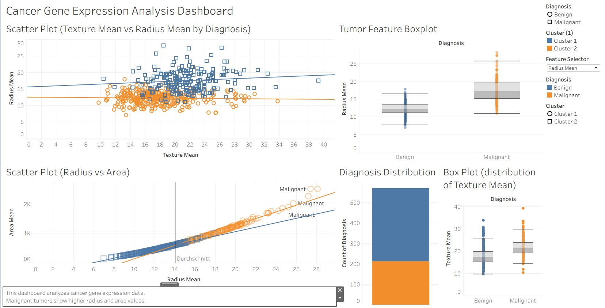

# Cancer Gene Expression Tableau Dashboard

This repository contains a Tableau dashboard project focused on analyzing cancer gene expression data. The goal of this project is to explore gene expression patterns across different cancer types and visualize meaningful biological insights using interactive dashboards.

## 📊 Project Overview

Cancer gene expression analysis helps in understanding how genes behave differently in cancerous vs normal tissues. This project leverages Tableau to create visual analytics that make complex biological data easier to interpret.
## 📁 Repository Structure
cancer-gene_expression_tableau-dashboard/
│
├── data/ # Raw and cleaned gene expression datasets
├── tableau/ # Tableau workbook (.twbx / .twb files)
├── images/ # Dashboard screenshots 
└── README.md # Project documentation

## 🧬 Features

- Visualization of gene expression levels across cancer types
- Comparative analysis of different genes
- Interactive filters for exploration
- Data-driven insights into expression patterns

## 🚀 How to Use

1. Clone the repository:
   git clone https://github.com/sudharshini-kannan/cancer-gene_expression_tableau-dashboard.git
2. Navigate into the project folder:
cd cancer-gene_expression_tableau-dashboard
3. Open the Tableau workbook file (.twb or .twbx) using Tableau Desktop.

👩‍🔬 Author
Sudharshini Kannan
   git clone https://github.com/sudharshini-kannan/cancer-gene_expression_tableau-dashboard.git

Navigate into the project folder:
